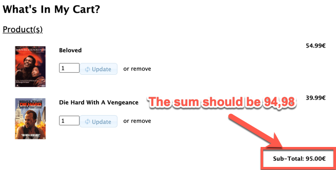

# Changelog

All changes to this project will be documented in this file.

The format is based on [Keep a Changelog](https://keepachangelog.com/en/1.0.0/),
and this project adheres to [Semantic Versioning](https://semver.org/spec/v2.0.0.html).

## [1.0.0] - 2021-08-02

### Functional bugs

#### Product search and listing

1. Text Displaying 1 to n (**of 1 products**) (instead of the real total of items). Example: Select on _Manufacturers_ the value _Fox_.

   

1. **Sort** product by name not working. Example: DVD Movies > Action, and click two times _Product name_ for sorting

1. **Advanced search** using _from price to price_ criteria not working. It does not found anything.

#### Product pricing

1. Change from _U.S. Dollar_ to _Euro_ at **Currencies** combobox. You'll see the prices are the same for euro and dollar.

   

   

#### Product rating

Select a product, push **Reviews** and then **Write Review**

Example:


1. **Rating is stored substracted by one**.

   

2. The reviews are not approved before being shown. Select again the product (with same or another user). You'll see the review comments.

#### Shopping cart

1. Header top shows a maximum of 1 cart item, even though there are more items.

   

2. You can use **Update** to set a negative number of items for a product. See as the final price is negative!
3. Final price of shopping cart is always rounded up!

   

4. Specials prices are not applied!

   

5. Setting a -1 for an item, seems like all the shopping cart is removed. If you add another item, the shopping cart is shown again.
6. Setting a 0 for an item does not remove it.

#### Checkout

1. Billing address is always the delivery address.

#### Accounts

1. Password forgotten option **not sending email**.

### Localization bugs

1. Top right button **Cart contents** is incorrectly labelled as **Cart contend**
2. Top right button **My account** is incorrectly labelled as **Mi cuenta**

### Security bugs

1. Password is not validated on login! (you can use any password)

### Product manufacturer bugs

1. Broken URL manufacturers (table \*manufacturers_info\*\*). Examples: Select a product of Hardware > Printers, and click on Manufacturer Info at right panel (HP).
2.

### Product search and listing

1. **Quick find**. It forces to search in exact case for product name. Example: Try to search "Mary" (of "There's Something About Mary")
   src/public_html/advanced_search_result.php

   Added binary at like to be case sensitive (line 231):

   ```
   $where_str .= "(pd.products_name like '%" . tep_db_input($keyword) . "%' or p.products_model like '%" . tep_db_input($keyword) . "%' or m.manufacturers_name like '%" . tep_db_input($keyword) . "%'";
           if (isset($HTTP_GET_VARS['search_in_description']) && ($HTTP_GET_VARS['search_in_description'] == '1')) $where_str .= " or pd.products_description like '%" . tep_db_input($keyword) . "%'";
           $where_str .= ')';
   ```

   to:

   ```
   $where_str .= "(pd.products_name like binary '%" . tep_db_input($keyword) . "%' or p.products_model like '%" . tep_db_input($keyword) . "%' or m.manufacturers_name like '%" . tep_db_input($keyword) . "%'";
   ```

   src/public_html/advanced_search_result.php (266)

   ```

   if ($pfrom > 0) $where_str .= " and (IF(s.status, s.specials_new_products_price, p.products_price) >= " . (double)$pfrom . ")";

   ```

### Product checkout

1. Billing address is the same as delivery.

   /public_html/checkout_confirmation.php. Comments about order not added

   211: <td><?php echo tep_address_format($order->delivery['format_id'], $order->delivery, 1, ' ', '<br />'); ?></td>

   - Gender only Female, Male not possible

### Account and login

#### Account creation

1. Use an incorrect email (line 91 commented)
1. Postcode is mandatory field, but it can be entered empty (line 111 commented)
1. Password confirmation can be different (line 164 commented)
1. Gender is saved always like female (line 180 forced to 'f')
1. Date of birth is not saved, it always save current date. (line 181 changed to assignation date('m/d/Y'))
