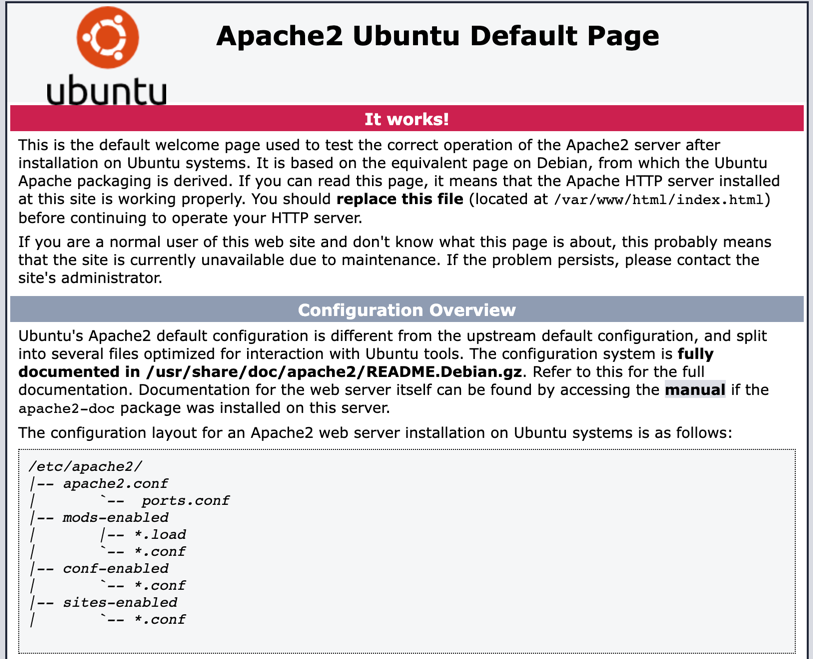
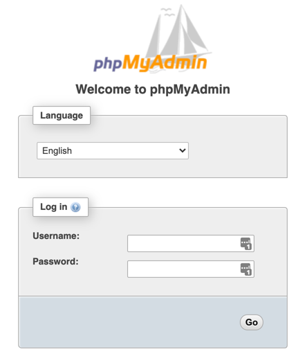

<div id="top"></div>

<!-- PROJECT LOGO -->
<br />
<div align="center">
  <a href="https://github.com/xescuder/buggy-oscommerce">
    
  </a>

  <h3 align="center">Buggy osCommerce for Testing</h3>

  <p align="center">
    A buggy application for testing purposes. Find bugs  with exploratory testing way or scripted!
    <br />
    <a href="https://github.com/xescuder/buggy-oscommerce"><strong>Explore the docs »</strong></a>
    <br />
    <br />
    <a href="http://vps-769d12b9.vps.ovh.net/oscommerce/">View Demo</a>
    ·
    <a href="https://github.com/xescuder/buggy-oscommerce/issues">Report Bug</a>
    ·
    <a href="https://github.com/xescuder/buggy-oscommerce/issues">Request Feature</a>
  </p>
</div>

<!-- TABLE OF CONTENTS -->
<details>
  <summary>Table of Contents</summary>
  <ol>
    <li>
      <a href="#about-the-project">About The Project</a>
      <ul>
        <li><a href="#built-with">Built With</a></li>
      </ul>
    </li>
    <li>
      <a href="#getting-started">Getting Started</a>
      <ul>
        <li><a href="#prerequisites">Prerequisites</a></li>
        <li><a href="#installation">Installation</a></li>
      </ul>
    </li>
    <li><a href="#usage">Usage</a></li>
    <li><a href="#license">License</a></li>
    <li><a href="#contact">Contact</a></li>
  </ol>
</details>

<!-- ABOUT THE PROJECT -->

## About The Project

Buggy osCommerce is a broken web application in order to understand behavior of bugs.

### Built With

- [osCommerce](https://www.oscommerce.com/Products)

<p align="right">(<a href="#top">back to top</a>)</p>

<!-- GETTING STARTED -->

## Getting Started

### Prerequisites

Make sure you have installed all of the following prerequisites on your VPS/cloud machine:

- Ubuntu 16.04 LTS
- Apache2
- MySQL
- PhpMyAdmin

You can fulfill easily these prerequisites using next steps:

1. Install Apache2:

   ```sh
   sudo apt update
   sudo apt install apache2
   sudo ufw allow in "Apache"
   ```

   Go to your server url and check Apache has been installed.

   

1. Install MySQL:

   ```sh
   sudo apt-get update
   sudo apt-get install mysql-server
   ```

   Check status:

   ```sh
   systemctl status mysql.service
   sudo service mysql start
   ```

1. Install Php:

   ```sh
   sudo apt-get install php
   ```

1. Install PhpMyAdmin:

   ```sh
   sudo apt-get install phpmyadmin
   ```

   Choose _web apache 2_ server, and configure database for phpmyadmin (yes). use the same password you've set on MySql root user.

   Open apache configuration file:

   ```sh
   sudo -H nano /etc/apache2/apache2.conf
   ```

   And add at the end:

   ```
   Include /etc/phpmyadmin/apache.conf
   ```

   Finally add Php Interpreter with:

   ```sh
   sudo apt-get install libapache2-mod-php
   ```

   Open a web browser to: http://your-server/phpmyadmin/ and see login is shown correctly.

   

### Installation

#### Installation of osCommerce

1. Download osCommerce application from [https://www.oscommerce.com/Products](https://www.oscommerce.com/Products) and unzip.

2. Create database:

   ```sh
   mysql –u root –p
   mysql> CREATE DATABASE oscommerce;
   mysql> GRANT ALL PRIVILEGES ON oscommerce.* TO 'phpmyadmin'@'localhost';
   mysql> quit
   ```

3. Create on server a new directory at `/var/www/html':

   ```sh
   cd /var/www/html
   mkdir oscommerce
   chmod -R 777 oscommerce/
   ```

4. Open a SFTP connection to your server (using for example `Filezilla`) and copy the unziped contents of folder `catalog` inside the folder `/var/www/html/oscommerce`.

5. Set permission to `oscommerce` folder:

   ```sh
   chmod -R 777 oscommerce/
   ```

6. Open in a browser the url: `<your-server>/oscommerce/install/` and push **Start**. Set the default values.

   - Database server: localhost
   - Username: root
   - Password: `<password used for db>`
   - Database name: oscommerce
   - WWW Address (leave default)
   - Webserver Root directory (leave default)
   - Store name: UPC School Agile IT Shop
   - Store ower e-mail address: `<your-email-address>`
   - Administrator username: root
   - Administrator password: `<set-a-password>`
   - Administration directory name: admin

7. Open a browser url to: `http://your-server/oscommerce/index.php`

Now we've osCommerce installed without injected bugs.

<p align="right">(<a href="#top">back to top</a>)</p>

<!-- USAGE EXAMPLES -->

## Usage

1. Clone the project at `https://github.com/xescuder/buggy-oscommerce`.
2. Copy the content of `src/public_html` into the server folder `/var/www/html/oscommerce` **overwriting** all files.

**For all the injected bugs in the application, please refer to the [Change log](CHANGELOG.md)**

After the injected bugs you can simulate more bugs updating the database, using _PhpMyAdmin_.

For example:

1. Incorrect images on some products (go to table 'products')

   - Blade Runner - Director's Cut (products_id=5)
   - You've Got Mail

1. Incorrect images on some products (go to table 'categories')

   - Hardware - Graphics cards, Keyboards

### Issues

After some experience in using osCommerce, and before the injected bugs, we can consider also as issues and bugs:

- Add more than 99 to quantity in one item of cart. Field allows you, but really only
  99 is allowed.
- A confirmation is not sent to the provided email address.
- Some buttons seem not really enabled (Continue or New Customer, Add to Cart, ...)
- After logoff I can see my previous Shopping Cart

<p align="right">(<a href="#top">back to top</a>)</p>

<!-- LICENSE -->

## License

Distributed under the MIT License. See `LICENSE.txt` for more information.

<p align="right">(<a href="#top">back to top</a>)</p>

<!-- CONTACT -->

## Contact

Xavier Escudero - [@xescuder](https://twitter.com/xescuder) - xescuder@gmail.com

Project Link: [https://github.com/xescuder/buggy-oscommerce](https://github.com/xescuder/buggy-oscommerce)

<p align="right">(<a href="#top">back to top</a>)</p>
